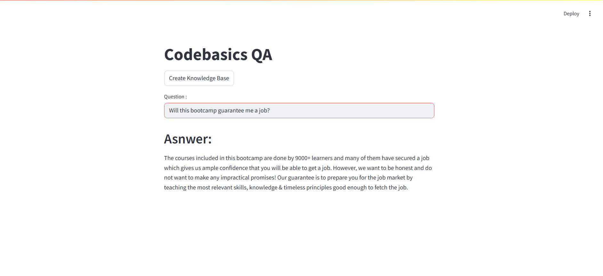

# Codebasics QA

#### This project implements a Question-Answering (QA) system where users can ask questions, and the system generates answers based on a knowledge base created from CSV files. The frontend is built using Streamlit, while Langchain handles the question-answering logic. FAISS is used for fast and efficient similarity search in the vector database. Poetry is used for managing dependencies.

---

### Table of Contents

1. Project Overview
2. Installation Instructions
3. Setup and Configuration
4. Usage
5. Screenshots

---

### Project Overview

This project enables the following functionality:

- **Create Knowledge Base**: Users can initialize a knowledge base using a CSV file that contains question-prompt pairs.
- **Ask Questions**: The app allows users to ask questions, and it returns the most relevant answers based on the knowledge base.
- **Tech Stack**:  
  - **Streamlit** for the frontend interface  
  - **Langchain** for chaining question-answer logic  
  - **FAISS** for vector-based similarity search  
  - **Poetry** for dependency management

---

### Installation Instructions

To set up and run this project locally, follow these steps.

#### 1. Clone this repository

```bash
git clone https://github.com/dishagopani05/codebasics-qa
cd your-repo-name
```

#### 2. Install dependencies using Poetry
Poetry manages the dependencies for this project. To install them, run the following command:

```bash
poetry install
``` 

#### 3. Set up the environment
Make sure to create a .env file in the root of your project directory and add the required environment variables (if any). For example:

```env 
GEMINI_API_KEY=your_gemini_api_key_here
```

#### 4. Run the application
After installing dependencies and setting up your environment, you can run the application by executing the following command:

```bash
poetry run streamlit run app.py
```
Once the app is running, visit `http://localhost:8501` in your web browser to interact with the QA system.

### Setup and Configuration

Make sure that the following steps are followed for proper setup and functionality:

Ensure that the CSV file containing question-prompt pairs is available in the project directory or provide the path to the CSV file in the code if necessary.

For the FAISS vector database, ensure that it is correctly created from the data and stored locally as needed.

### Usage

Once the application is running, you can use the following features:
- **Create Knowledge Base**: Click the button to initialize the knowledge base using the data from a CSV file.
- **Ask Questions**: Type any relevant question into the input field. For example:

  - "What is the answer to the first prompt?"
  - "What does the second question respond to?"

The system will generate a relevant answer based on the knowledge base created earlier. You can ask multiple questions, and the app will retrieve the most relevant response based on the CSV data.


### Screenshots

